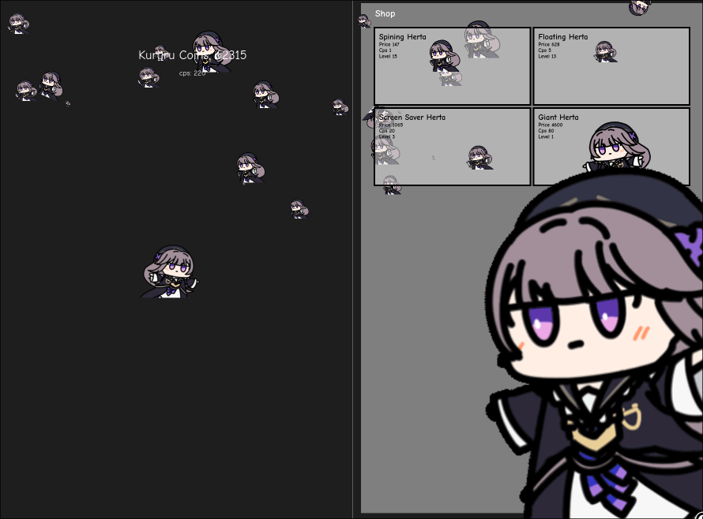

# KURURIDLE

An idle/clicker fan game based on Honkai Star Rail. Click Herta to earn Kururu Coins, then spend them in the shop to earn coins automatically.



## Built with

- Vue 3 (Composition API + `<script setup>`)
- TypeScript
- Vite
- CSS (no UI libraries)

## How to play

- Click Herta to earn **Kururu Coins** (+1 per click, with animations and screen shake).
- Buy Hertas in the shop to increase your **CPS** (coins per second), added automatically every second.
- Each purchase levels up the item and raises its price by **15%**.
- Progress is saved automatically in the browser via `localStorage`.

### Shop

| Item | Base price | CPS |
| --- | --- | --- |
| Spining Herta | 15 | 1 |
| Floating Herta | 100 | 5 |
| Screen Saver Herta | 700 | 20 |
| Giant Herta | 4000 | 80 |

Purchased Hertas appear on screen with their own animations (spinning, floating, DVD-style screen saver...).

## Running locally

```bash
npm install
npm run dev
```

Other useful scripts:

```bash
npm run build        # Type-check + production build
npm run type-check   # vue-tsc only
npm run lint         # ESLint with --fix
npm run format       # Prettier over src/
npm run preview      # Preview the production build
```